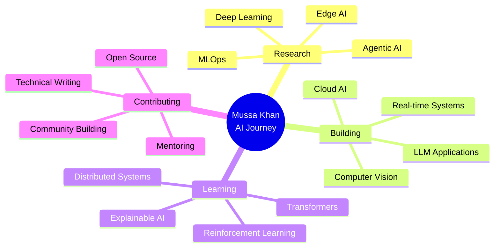

<div align="center">

# 🌟 Welcome to Mussa Khan's AI Universe


[](https://git.io/typing-svg)

<p align="center">
  
  
  
</p>

</div>

---

## 🎯 About Me


```python
class MussaKhan:
    def __init__(self):
        self.name = "Mussa Khan"
        self.location = "📍 Islamabad, Pakistan"
        self.role = "AI Architect & ML Engineer"
        self.passion = "Building Intelligent Systems"
        
    def current_focus(self):
        return {
            "research": ["Deep Learning", "MLOps", "Agentic AI"],
            "building": ["Computer Vision Systems", "LLM Apps"],
            "exploring": ["Generative AI", "Full-Stack Dev"],
            "learning": ["Advanced Transformers", "Edge AI"]
        }
    
    def fun_facts(self):
        return [
            "🧠 20+ AI/ML Projects",
            "☕ Coffee-Powered Developer",
            "🌱 Lifelong Learner",
            "💡 Problem Solver at Heart"
        ]
```

<br>

### 🚀 Quick Highlights

<div align="center">

| 📊 Metric | 🎯 Achievement |
|-----------|----------------|
| **Repositories** | 20+ Active Projects |
| **Code Written** | 100,000+ Lines |
| **ML Models** | 50+ Trained & Deployed |
| **Technologies** | 25+ Tools & Frameworks |
| **Community** | Open Source Contributor |

</div>

---

## 🛠️ Technology Stack

<div align="center">

### 💻 Languages & Core


### 🤖 AI/ML & Data Science


### 🌐 Web Development


### 🛠️ DevOps & Tools


</div>

---

## 🌟 Featured Projects

<div align="center">

### 🤖 **AI & Machine Learning Excellence**

</div>

<table>
<tr>
<td width="50%" valign="top">

#### 🎯 [AI-Powered Adaptive Quiz Generator](https://github.com/musagithub1/-AI-Powered-Adaptive-Quiz-Generator)

  

**Transform learning with AI-powered quizzes**

- 📚 Upload lectures → Auto-generate quizzes
- 🎯 Personalized adaptive learning
- 📄 Multi-format export (ODT, PDF)
- 🧠 Intelligent question generation

> *Making education adaptive and personalized*

</td>
<td width="50%" valign="top">

#### 📝 [Assignment Generator AI Agent](https://github.com/musagithub1/Assignment-Generator-AI-Agent)

  

**AI-powered academic report generation**

- 📋 Upload question papers
- 🤖 LangGraph-powered analysis
- 📊 Automated academic reports
- 💾 PDF export functionality

> *Automating academic workflows*

</td>
</tr>

<tr>
<td width="50%" valign="top">

#### 🎤 [Mock Interview AI App](https://github.com/musagithub1/mock-interview-app-latest)

  

**Your AI interview practice partner**

- 💼 Technical, Behavioral & General interviews
- ⚡ Real-time feedback per question
- 📊 Comprehensive evaluation reports
- 💬 Complete conversation history

> *Practice makes perfect*

</td>
<td width="50%" valign="top">

#### 💳 [CreditIQ Predictor](https://github.com/musagithub1/credit_scoring_project)

  

**Advanced credit risk assessment platform**

- 📈 94% prediction accuracy
- 🔄 Ensemble learning (LR, DT, RF, XGBoost)
- 📊 Interactive risk dashboard
- 🔍 Model interpretability with SHAP

 ⭐ **11 Stars**

</td>
</tr>

<tr>
<td width="50%" valign="top">

#### 🐾 [One Health AI Platform](https://github.com/musagithub1/One_Health_AI_Platform)

  

**Complete pet healthcare management**

- 🏥 Pet registration & health tracking
- 🔍 Lost pet recovery system
- 🤖 AI-driven health insights
- 📱 All-in-one platform

> *Healthcare for our furry friends*

</td>
<td width="50%" valign="top">

#### 🛡️ [Spam Detector](https://github.com/musagithub1/Spam-Detector)

  

**ML-powered spam detection**

- 📱 SMS classification (Spam/Ham)
- 🎨 Intuitive Streamlit interface
- 🐳 Dockerized deployment
- 🎯 High accuracy classification

> *Keep your inbox clean*

</td>
</tr>
</table>

---

<div align="center">

### 🎨 **Computer Vision & Real-Time Systems**

</div>

<table>
<tr>
<td width="50%" valign="top">

#### 🚗 [License Plate Detection System](https://github.com/musagithub1/license-plate-detection-opencv-yolov8)

  

**⚡ Real-time detection under 50ms**

- 🎯 Dual model architecture (Haar + YOLO)
- 🚀 ONNX optimization
- ⏱️ Real-time processing pipeline
- 📹 Multi-format support

 ⭐ **9 Stars**

</td>
<td width="50%" valign="top">

#### 😊 [Face Detection & Emotion Analysis](https://github.com/musagithub1/FACE_DETECTION_PROJECT)

  

**Advanced face detection & emotion recognition**

- 😃 Emotion recognition with DeepFace
- 👤 Haar cascades detection
- ⚡ Real-time face analysis
- 🔄 Multi-model approach

> *Understanding human emotions*

</td>
</tr>
</table>

---

<div align="center">

### 🌐 **Full-Stack Development**

</div>

<table>
<tr>
<td width="50%" valign="top">

#### 🔄 [JSON-to-TOON Converter](https://github.com/musagithub1/json-to-toon-Converter)

  

**Full-stack format converter**

- 🔧 FastAPI backend (Python)
- ⚛️ React + Tailwind frontend
- 🔄 Bidirectional conversion
- ⚡ Modern Vite build system

 

</td>
<td width="50%" valign="top">

#### 💻 [Python Code Assistant AI Bot](https://github.com/musagithub1/python-code-assistant-ai-bot)

  

**Advanced AI developer tool**

- 🧠 Context-aware code generation
- 🖥️ Dual UI (Web & Terminal)
- 🐛 Smart error detection
- ▶️ Code execution capabilities

 ⭐ **4 Stars**

</td>
</tr>

<tr>
<td width="50%" valign="top">

#### 🎮 [Snake Game](https://github.com/musagithub1/snake-game)

  

**Classic snake game reimagined**

- 🕹️ Smooth movement controls
- 🍎 Food collection system
- 📊 Score tracking
- ✨ Clean HTML/CSS/JS

> *Nostalgia meets modern code*

</td>
<td width="50%" valign="top">

#### 📋 [To-Do List Manager](https://github.com/musagithub1/To-do-list-manager-cpp)

 

**Console-based task management**

- 💾 File persistence
- 📂 Task categorization
- ✅ Complete CRUD operations
- 🎯 Clean C++ implementation

 ⭐ **2 Stars**

</td>
</tr>
</table>

---

<div align="center">

### 🔐 **Cybersecurity & Research**

</div>

<table>
<tr>
<td width="50%" valign="top">

#### 🔍 [Network Packet Sniffer](https://github.com/musagithub1/CodeAlpha_NetworkSniffer)

  

**Network analysis & monitoring tool**

- 📡 Real-time packet capture
- 🔬 Protocol analysis
- 📊 Network monitoring
- 🎓 Educational project

 

</td>
<td width="50%" valign="top">

#### 📅 [30 Days Agentic AI Plan](https://github.com/musagithub1/30-days-agentic-ai-plan)

  

**Structured Agentic AI learning roadmap**

- 📚 Daily learning objectives
- 📄 Research papers & projects
- 🎥 Content creation plan
- 📱 Social media strategy

> *30 days to AI mastery*

</td>
</tr>

<tr>
<td width="50%" valign="top">

#### 🎬 [Google Veo 3 Business Prompts](https://github.com/musagithub1/google-veo3-business-prompts)

  

**Open-source prompt engineering**

- 📈 Marketing use cases
- ✍️ Content creation prompts
- 🎨 AI-driven storytelling
- 💼 Business applications

> *Unleashing creative AI*

</td>
<td width="50%" valign="top">

#### 🏛️ [Archon OS](https://github.com/musagithub1/Archon-OS)

  

**AI assistant management system**

- 🤖 AI coding backbone
- 📋 Task orchestration
- 🧠 Knowledge management
- 🚧 Beta release

 

</td>
</tr>
</table>

---

## 📊 GitHub Analytics

<div align="center">


</div>

---

## 🏆 GitHub Achievements

<div align="center">


</div>

---

## 🎯 Current Focus & Vision

<div align="center">



</div>

### 🔬 **Research & Development**
- 🧠 Advanced Computer Vision Algorithms
- 🤖 Agentic AI & Multi-Agent Systems
- ☁️ MLOps & Cloud AI Deployment
- 🎨 Generative AI Applications
- 📱 Edge AI & Mobile Deployment

### 🚀 **Active Projects**
- 👁️ Real-time Multi-Object Recognition
- 📊 Intelligent Analytics Platform
- 🌐 Open Source ML Contributions
- 🎨 AI-Powered Creative Tools

### 📚 **Continuous Learning**
- 🔤 Large Language Models (LLMs)
- 🎮 Reinforcement Learning
- 🔄 Transformer Architectures
- ⚖️ AI Ethics & Responsible AI

---

## 🌐 Connect & Collaborate

<div align="center">

<a href="https://github.com/musagithub1">
  
</a>
<a href="https://linkedin.com/in/yourprofile">
  
</a>
<a href="mailto:your.email@example.com">
  
</a>
<a href="https://yourportfolio.com">
  
</a>

<br><br>

### 💬 Let's Build Something Amazing Together!

I'm always excited to collaborate on:

🤝 **AI/ML Projects** • 💡 **Innovative Ideas** • 🔬 **Research Opportunities** • 📚 **Knowledge Sharing** • 🚀 **Open Source Contributions**

</div>

---

## 💡 Developer Wisdom

<div align="center">


<br><br>

### 🎮 Contribution Snake

<picture>
  <source media="(prefers-color-scheme: dark)" srcset="https://raw.githubusercontent.com/musagithub1/musagithub1/output/github-contribution-grid-snake-dark.svg">
  <source media="(prefers-color-scheme: light)" srcset="https://raw.githubusercontent.com/musagithub1/musagithub1/output/github-contribution-grid-snake.svg">
  
</picture>

</div>

---

## 📈 Detailed Analytics

<div align="center">

<table>
<tr>
<td align="center">

</td>
<td align="center">

</td>
<td align="center">

</td>
</tr>
</table>

</div>

---

<div align="center">


### ✨ *"Transforming Ideas into Intelligent Solutions"* ✨

**Made with ❤️ by Mussa Khan**

*Last Updated: November 2025*

<sub>⭐ Star my repositories if you find them useful!</sub>

</div>
